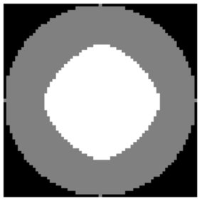

# 3D Cell Parameterization

[](https://github.com/AllenCell/aics-cytoparam/actions)
[](https://AllenCell.github.io/aics-cytoparam/)
[](https://codecov.io/gh/AllenCell/aics-cytoparam)

### Spherical harmonics coefficients-based parameterization of the cytoplasm and nucleoplasm for 3D cells


---
## Installation

**Stable Release:** `pip install aicscytoparam`<br>
**Development Head:** `pip install git+https://github.com/AllenCell/aics-cytoparam.git`

## How to use

Here we outline an example of how to use `aicscytoparam` to create a parameterization of a 3D cell. In this case, the 3D cells will be represented by a cell segementation, nuclear segmentation and a fluorescent protein (FP) image representing the fluorescent signal of a tagged protein.

```python
# Import required packages
import numpy as np
import matplotlib.pyplot as plt
from aicscytoparam import cytoparam
from skimage import morphology as skmorpho
```

```python
# First create a cuboid cell with an off-center cuboid nucleus
# and get the spherical harmonics coefficients of this cell and nucleus:
w = 100
mem = np.zeros((w, w, w), dtype = np.uint8)
mem[20:80, 20:80, 20:80] = 1
nuc = np.zeros((w, w, w), dtype = np.uint8)
nuc[40:60, 40:60, 30:50] = 1

# Create an FP signal located in the top half of the cell and outside the
# nucleus:
gfp = np.random.rand(w**3).reshape(w,w,w)
gfp[mem==0] = 0
gfp[:, w//2:] = 0
gfp[nuc>0] = 0

# Vizualize a center xy cross-section of our cell:
plt.imshow((mem + nuc)[w//2], cmap='gray')
plt.imshow(gfp[w // 2], cmap='gray', alpha=0.25)
plt.axis('off')
```


```python
# Use aicsshparam to expand both cell and nuclear shapes in terms of spherical
# harmonics:
coords, coeffs_centroid = cytoparam.parameterize_image_coordinates(
    seg_mem=mem,
    seg_nuc=nuc,
    lmax=16, # Degree of the spherical harmonics expansion
    nisos=[32, 32] # Number of interpolation layers
)
coeffs_mem, centroid_mem, coeffs_nuc, centroid_nuc = coeffs_centroid

# Run the cellular mapping to create a parameterized intensity representation
# for the FP image:
gfp_representation = cytoparam.cellular_mapping(
    coeffs_mem=coeffs_mem,
    centroid_mem=centroid_mem,
    coeffs_nuc=coeffs_nuc,
    centroid_nuc=centroid_nuc,
    nisos=[32, 32],
    images_to_probe=[('gfp', gfp)]
).data.squeeze()

# The FP image is now encoded into a representation of its shape:
print(gfp_representation.shape)
```

`(65, 8194)`

```python
# Now we want to morph the FP image into a round cell.
# First we create the round cell:

from skimage import morphology as skmorpho
mem_round = skmorpho.ball(w // 3) # radius of our round cell
nuc_round = skmorpho.ball( w// 3) # radius of our round nucleus
# Erode the nucleus so it becomes smaller than the cell
nuc_round = skmorpho.binary_erosion(
    nuc_round, selem=np.ones((20, 20, 20))
    ).astype(np.uint8)

# Vizualize a center xy cross-section of our round cell:
plt.imshow((mem_round + nuc_round)[w // 3], cmap='gray')
plt.axis('off')
```



```python
# Next we need to parameterize the coordinates of our round
# cell:
coords_round, _ = cytoparam.parameterize_image_coordinates(
    seg_mem=mem_round,
    seg_nuc=nuc_round,
    lmax=16,
    nisos=[32, 32]
)

# Now we are ready to morph the FP image into our round cell:
gfp_morphed = cytoparam.morph_representation_on_shape(
    img=mem_round + nuc_round,
    param_img_coords=coords_round,
    representation=gfp_representation
)
# Visualize the morphed FP image:
plt.imshow((mem_round + nuc_round)[w // 3], cmap='gray')
plt.imshow(gfp_morphed[w // 3], cmap='gray', alpha=0.25)
plt.axis('off')
```


## Reference

For an example of how this package was used to analyse a dataset of over 200k single-cell images at the Allen Institute for Cell Science, please check out our paper in [bioaRxiv](https://www.biorxiv.org/content/10.1101/2020.12.08.415562v1).

## Development

See [CONTRIBUTING.md](CONTRIBUTING.md) for information related to developing the code.

## Questions?

If you have any questions, feel free to leave a comment in our Allen Cell forum: [https://forum.allencell.org/](https://forum.allencell.org/). 


***Free software: Allen Institute Software License***
